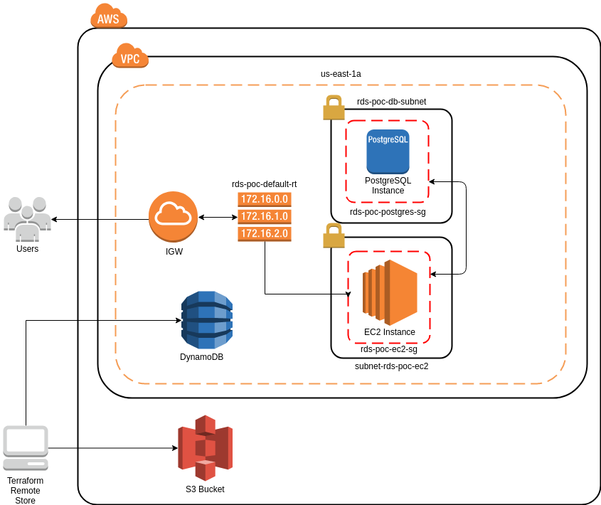

# rds-poc

POC of remote state in Terraform with RDS and EC2 instances

**Diagram**



**Pre-Requisites**

* Configure your `AWS_ACCESS_KEY_ID` and your `AWS_SECRET_ACCESS_KEY`
```
 export AWS_ACCESS_KEY_ID=XXXXXXXXX
 export AWS_SECRET_ACCESS_KEY=XXXXXXXXX
```
* Create your ssh Key Pair

**Steps**
* On bucket_s3 directory:

  ```
    $ cd bucket_s3
  ```

  - You can run the following commands:
    ```
      $ terraform init
      $ terraform plan
      $ terraform apply
    ```
  - After the execution, the file "resources/remote_s3_bucket.sh" will be created with the s3 bucket name

  - Also, the S3 bucket will be disponible to use as remote state

* On main directory:

  ```
    $ cd main
  ```

  - Update the file "resources/main.tfvars" if you need
    - In this case the file is encrypted with git-crypt because has sensitive data

  - Update the file "resources/user_data.txt" with the commands that you want to run in EC2 instance boot
    - This file is also encrypted with git-crypt

  - After, you will execute "terraform init" with the following parameter:
    ```
    $ terraform init -backend-config="bucket_name_created_in_bucket_s3"
    ```
  - As alternative, you can get the bucket name using the following command:
    ```
    $ . ../resources/remote_s3_bucket.sh
    $ terraform init -backend-config="bucket=${REMOTE_BUCKET_NAME}"
    ```
  - After, you can execute the following steps
    ```
    $ terraform plan
    $ terraform apply
    ```

After the execution, the file "resources/addresses.txt" will be created in with RDS endpoint, DB name and EC2 public IP.
